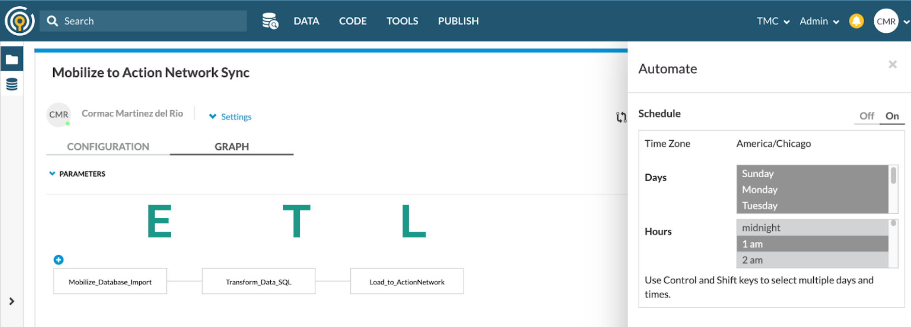
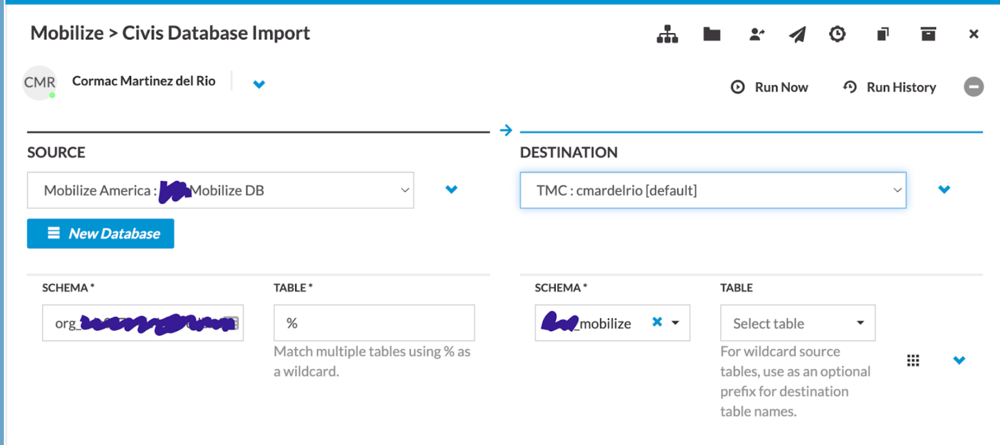
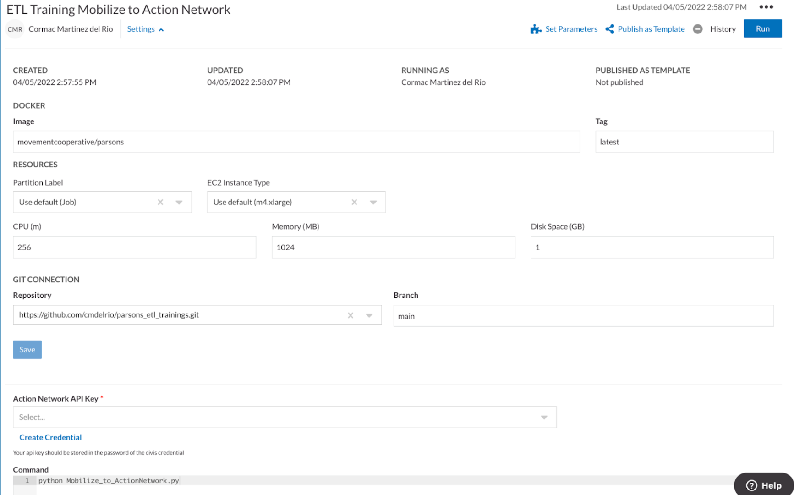

==================================
Introduction to ETL Best Practices
==================================

This training guide will walk you through some basic ETL workflows using Parsons. It is based off of a two-part training designed by Cormac Martinez del Rio and Shauna Gordon-McKeon.

It introduces the basic concepts behind the Extract, Transform and Load (ETL) process by working through two examples. First, we focus on how to write a basic Parsons script that moves data between one platform (Mobilize) and another (Google Sheets). Then, we introduce some more advanced concepts such as data warehouses, platforms like Civis, and the use of log tables and schedulers to make your workflow easier to run and debug.

.. contents:: Table of Contents
    :depth: 3

You can suggest improvements to this guide or request additional guides by filing an issue in our issue tracker or telling us in Slack. To get added to our Slack, and/or to request access to the recordings of this training, email us at *engineering@movementcooperative.org*.

********
Part One
********

^^^^^^^^^^^^
Introduction
^^^^^^^^^^^^

Have you ever tried to get data from one platform or system to another? Doing so can be quite a pain, especially if you have to manually download and upload individual files. Luckily, websites and apps often have APIs, which stands for application programming interfaces. These are gateways that let us move data into and out of a system using code.

**ETL**, which stands for Extract, Transform, and Load is the process by which we extract data from one systems API, transform that data so that it’s compatible with a second system's API, and then loading that data into that second system.

The format that source system gives us data is often different from the format that another system likes receiving data! Everyone thinks their way is best.
Not so good for the movement, good for data engineers' job security. ;)

Parsons can help us with every step of the way. We can use parsons to extract, transform, and load data!

Today we're going to be using a Parsons script to move data from Mobilize to Google Sheets. Our inspiration was an experience Shauna had managing canvassing volunteers who had signed up on Mobilize, but whose canvassing status was being tracked via Google Sheets.

The example script can be found in full `on Github <https://gist.github.com/shaunagm/d429ace958ee6ce1b71fbe7884611348>`_.

If you need help getting set up with Parsons so that you can run this script, check out our `getting started training guide <getting_set_up.html>`_.

Okay, let's proceed!

^^^^^^^^^^^^^^
Authentication
^^^^^^^^^^^^^^

In order to access our data from Mobilize and add it to Google Sheets, we need to authenticate ourselves to these two services. We do this by getting the relevant credentials from the platform and then saving them to specific environmental variables.

Each Parsons connector has a page in the documentation, and at the top of each page is a description of what credentials you need and how to get them. Sometimes this is straightforward, and sometimes it's more complicated.

########
Mobilize
########

To access Mobilize, you'll need to get an API key by contacting a support representative. If you don't have an account but would like to follow along anyway, we've provided some fake Mobilize data which we'll walk you through accessing below.

If you were able to get an API key, you can now save it as the environmental variable ``MOBILIZE_AMERICA_API_KEY`` by running this command on the command line::

    set MOBILIZE_AMERICA_API_KEY=$API_KEY       # Windows
    export MOBILIZE_AMERICA_API_KEY=$API_KEY    # Linux/Mac

(Not comfortable with the command line? Check out our `training guide <getting_set_up.html>`_.)

And that's it, you're done! When you instantiate the Mobilize connector, it will look in the environment for ``MOBILIZE_AMERICA_API_KEY``. If it finds the key, it can use it to handle all the authentication for you.

.. note::

    What do we mean, "when you instantiate the Mobilize connector"? We've created the Mobilize connector class, which has general features anyone can use to work with Mobilize. But in order to actually work with that class, you need to create a "instance" of it. That instance will have data specific to you, such as your API key.

    "Instantiation" is just a fancy way to say "create an instance of". In Python, you instantiate something by calling it with parentheses, ie: ``mobilize_instance = Mobilize()``.

#############
Google Sheets
#############

Setting up the Google Sheets connector takes several steps.

First, you'll need to go to the `Google Developers Console <https://console.cloud.google.com/>`_ and select the project you want to work with, or create a new one (recommended). Following `these instructions from Google <https://developers.google.com/drive/api/guides/enable-drive-api>`_, click **APIs & Auth** and then **APIs**. Select the Drive API from among the API options, and click **enable**.

Once you've created a project and enabled the API, you'll need to get the credentials that will allow you to access the API. Click on the **credentials** option in the left sidebar. Click **create credentials** and select the **Service Account** option. Once you have filled out the form and clicked submit, it will give you a set of credentials as a json string which you can save to a file.

Now we need to tell Parsons where it can find the credentials. We'll set an environmental variable ``GOOGLE_DRIVE_CREDENTIALS`` which is the path to where your credentials are stored (replace the paths below with your correct paths)::

    set GOOGLE_DRIVE_CREDENTIALS="C:\Home\Projects\"      # Windows
    export GOOGLE_DRIVE_CREDENTIALS="/home/projects/"     # Linux/Mac

Learn more about paths :ref:`here <path-explainer>`.

Finally, look inside the credentials file for an email address in the field ``client_email``. It will look something like ``service-account@projectname-123456.iam.gserviceaccount.com``. Go to the Google Drive UI for the folder you want to work with and share the folder with this email address.

^^^^^^^^^^^^^^^^^^^^^^^^^^^^
Extracting Data from Moblize
^^^^^^^^^^^^^^^^^^^^^^^^^^^^

#################################
Setting up: Imports and Instances
#################################

Before we jump into moving data around, lets import all the things we need and instantiate our connectors.

Your imports should look like this::

    import json
    from datetime import datetime
    from parsons import Table, MobilizeAmerica, GoogleSheets

`json <https://docs.python.org/3/library/json.html>`_ is a Python module that helps us convert between data in a JSON format (which is a popular way to store and share data) and Python data structures.

`datetime <https://docs.python.org/3/library/datetime.html>`_  is a Python module that helps us work more easily with dates and times.

Finally, from Parsons, we're importing the two connectors we're using, plus the Parsons Table object. The Parsons Table is the core data structure in Parsons. It's a standardized way to hold data, which makes it very easy to move data between vendors even if the vendors have different structures.

We instantiate our connectors with this code::

    mobilize = MobilizeAmerica()
    google_sheets = GoogleSheets()

And we're ready to start extracting!

##########
Extracting
##########

We're going to extract some data on attendance from Mobilize. We can do that with this code::

    attendance_records = mobilize.get_attendances()

If you weren't able to get an authenticated Mobilize account, you can use the fake Mobilize data in `this google sheet <https://docs.google.com/spreadsheets/d/1YZr6gXmptxfzqb_t58frwNHhVu_KMTQzvMpnNUZd47I/>`_::

    spreadsheet_id = "1YZr6gXmptxfzqb_t58frwNHhVu_KMTQzvMpnNUZd47I"
    attendance_records = google_sheets.get_worksheet(spreadsheet_id)

And...that's it! We've got our data. Let's take a look at what we've extracted::

    print(attendance_records)

The result should look like this::

    {'id': '46273', 'event_id': '454545', 'event_title': 'January Canvass', 'timeslot_id': '738375', 'timeslot_start_date': '1642865400', 'timeslot_end_date': '1642872600', 'status': 'REGISTERED', 'attended': 'true', 'person': '{"id": 1, "given_name": "Lou", "family_name": "Slainey", "email_address": "lslainey0@unicef.org", "phone_number": "3271326753", "postal_code": "78737"}'}
    {'id': '46274', 'event_id': '454546', 'event_title': 'January Textbank', 'timeslot_id': '239573', 'timeslot_start_date': '1643563800', 'timeslot_end_date': '1643527800', 'status': 'REGISTERED', 'attended': 'true', 'person': '{"id": 2, "given_name": "Arleyne", "family_name": "Ransfield", "email_address": "aransfield1@qq.com", "phone_number": "2174386332", "postal_code": "78737"}'}
    {'id': '46275', 'event_id': '454547', 'event_title': 'February Canvass', 'timeslot_id': '183743', 'timeslot_start_date': '1644939000', 'timeslot_end_date': '1644946200', 'status': 'REGISTERED', 'attended': 'true', 'person': '{"id": 3, "given_name": "Alameda", "family_name": "Blackmuir", "email_address": "ablackmuir2@wisc.edu", "phone_number": "3844977654", "postal_code": "78737"}'}
    {'id': '46276', 'event_id': '454548', 'event_title': 'February Phonebank', 'timeslot_id': '283666', 'timeslot_start_date': '1645378200', 'timeslot_end_date': '1645342200', 'status': 'REGISTERED', 'attended': 'true', 'person': '{"id": 4, "given_name": "Bondie", "family_name": "Berrow", "email_address": "bberrow3@discuz.net", "phone_number": "2275080414", "postal_code": "78737"}'}
    {'id': '46277', 'event_id': '454549', 'event_title': 'March Relational Organizing Hour', 'timeslot_id': '477483', 'timeslot_start_date': '1648218600', 'timeslot_end_date': '1648225800', 'status': 'REGISTERED', 'attended': 'true', 'person': '{"id": 5, "given_name": "Korrie", "family_name": "Spight", "email_address": "kspight4@sakura.ne.jp", "phone_number": "9818241063", "postal_code": "78737"}'}
     ...

There are more than five rows in our table, but ``print`` only displays the first five rows by default, for readability's sake.

As you can see, this data corresponds to what's in the Google sheet. We display the data in a Python dictionary, with the column names as keys and the actual contents of each cell as the values. You can ask for any row of a Parsons Table as a dictionary::

    print(attendance_records[0])
    >> {'id': '46273', 'event_id': '454545', 'event_title': 'January Canvass', 'timeslot_id': '738375', 'timeslot_start_date': '1642865400', 'timeslot_end_date': '1642872600', 'status': 'REGISTERED', 'attended': 'true', 'person': '{"id": 1, "given_name": "Lou", "family_name": "Slainey", "email_address": "lslainey0@unicef.org", "phone_number": "3271326753", "postal_code": "78737"}'}

You can also get any column of a Parsons Table as a list of values::

    print(attendance_records["event_title"])
    >> ['January Canvass', 'January Textbank', 'February Canvass', 'February Phonebank', 'March Relational Organizing Hour' ...

Because individual rows are treated as dictionaries, and individual columns as list, that makes it easy to iterate over them with a for loop::

    for index, attendance in enumerate(attendance_records):
        print(attendance['person'])

There are also a couple of convenience methods for getting the total number of rows and the list of column names::

    attendance_records.num_rows
    attendance_records.columns

No matter where you got your data from, these methods should always work! That's the benefit of using a standardized format like a Parsons Table.

^^^^^^^^^^^^^^^^^^^^^^^^^^^^^^
Transforming Data with Parsons
^^^^^^^^^^^^^^^^^^^^^^^^^^^^^^

####################
Fixing Dates + Times
####################

Let's make some fixes to our data. First off, those timeslot fields are confusing! What kind of date is ``1642865400``?

(It's actually something called a `unix timestamp <https://www.unixtimestamp.com/>`_, which measures the total number of seconds since January 1st, 1970. Why January 1st, 1970? No real reason! They just needed to pick a date and I guess that seemed like a good one.)

Let's convert these unix timestamps to something more readable. To do this, we define a function that takes in a value and returns a value::

    def convert_to_legible_date(unix_date):
        return datetime.utcfromtimestamp(int(unix_date)).strftime('%Y-%m-%d %H:%M:%S')

Here, we're using the ``datetime`` library mentioned above. The ``strftime`` method is what determines the new format. For example, ``%Y`` means "Year with century as a decimal number" (like, say, 1970), and ``%m`` means "Month as a zero-padded decimal number" (like, say, 01). Here's a `cheatsheet <https://strftime.org/>`_ in case you want to play around with the formatting.

Once we've got our function, we can apply it to all the rows in a column by using the Parsons Table's ``convert_column`` function::

    attendance_records.convert_column('timeslot_start_date', convert_to_legible_date)

Notice how the first parameter passed to the method names the column to be converted, while the second parameter is the function to be applied to each row in the column. The original value of the cell will be passed into the function, and whatever is returned will be the new value of the cell.

##################
Unpacking a Column
##################

Currently in our table, each person's contact info is crammed into a single column, formatted as a JSON string. That's a bummer!::

    'person': '{"id": 1, "given_name": "Lou", "family_name": "Slainey", "email_address": "lslainey0@unicef.org", "phone_number": "3271326753", "postal_code": "78737"}'

We can turn these fields into their own columns in two steps.

First, we're going to convert that column from a json string to a Python dictionary. As long as the string is formatted correctly, the only thing we need to do is pass in the ``json.loads`` method::

    attendance_records.convert_column('person', json.loads)

Then we can use a special Parsons method, ``unpack_dict``, to turn the keys of a dictionary into multiple columns!::

    attendance_records.unpack_dict('person', prepend=False)

###########################
Aggregating Data Using PETL
###########################

Parsons tables are built on top of PETL tables. `PETL <https://petl.readthedocs.io/en/stable/>`_ is a general purpose Python package for data science similar to `PANDAS <https://pandas.pydata.org/>`_.

Because Parsons tables are built on PETL tables, you can use any PETL function on a Parsons Table. Just convert your Parsons table to a PETL table with the ``.table`` method::

    petl_table = attendance_records.table

One example of a useful PETL function is ``Aggregate()`` which allows you to summarize data across rows. For instance, the following code gets the total number of signups by event::

    sign_ups_by_event_petl = petl_table.aggregate('event_title', len)

We can then convert the result back into a Parsons Table, if needed::

    sign_ups_by_event_parsons = Table(sign_ups_by_event_petl)

##############
Selecting Rows
##############

One last transformation! Let's use the ``select_rows`` function to separate the event attendances by the month that they happened::

    jan_attendances = attendance_records.select_rows("'2022-01' in {timeslot_start_date}")
    feb_attendances = attendance_records.select_rows("'2022-02' in {timeslot_start_date}")
    mar_attendances = attendance_records.select_rows("'2022-03' in {timeslot_start_date}")

Note that this only works if we successfully transformed ``timeslot_start_date`` above!

^^^^^^^^^^^^^^^^^^^^^^^^^^^^^
Loading Data to Google Sheets
^^^^^^^^^^^^^^^^^^^^^^^^^^^^^

Let's go ahead and create a new spreadsheet to load data into. We'll put it in a folder that already exists. To get the folder ID below, look in the URL. The folder ID is the long string of letters and numbers, like so::

    folder_id = "1y1jgygK5YUQLVrgRgNw7A8Hf2ppqOJJZ"  # get from URL

We also need to give our new spreadsheet a name::

    spreadsheet_name = "Volunteer Attendance Records"

We can use these two variables with the ``create_spreadsheet`` command, and save the sheet_id for later use::

   sheet_id = google_sheets.create_spreadsheet(spreadsheet_name, folder_id=folder_id)

The ``overwrite_sheet`` overwrites an existing sheet with data::

    google_sheets.overwrite_sheet(sheet_id, jan_attendances)
    google_sheets.overwrite_sheet(sheet_id, feb_attendances)

If you run both commands, you should only see the February attendances, because they'll have overwritten the January ones. But maybe you don't want to do that. Maybe you want to append all the data. You can do that too::

    google_sheets.overwrite_sheet(sheet_id, jan_attendances)
    google_sheets.append_to_sheet(sheet_id, feb_attendances)
    google_sheets.append_to_sheet(sheet_id, mar_attendances)

Note how the first command overwrites the sheet, starting us fresh, but the other two use ``append_to_sheet``.

You can also format cells using the ``format_cells`` method::

    red = {"red": 1.0, "green": 0.0, "blue": 0.0}
    google_sheets.format_cells(sheet_id, "A1",  {"backgroundColor": red}, worksheet=0)

Formatting a random cell red is a bit silly though. Let's try a more interesting example. We're going to overwrite our attendance records, just to make sure we're working from a fresh start. Then we'll go through the records one by one and, if the person didn't attend, we'll make their background red::

    google_sheets.overwrite_sheet(sheet_id, attendance_records)  # overwrite sheet

    for index, row in enumerate(attendance_records):
        adjusted_index = index + 2   # accounts for python zero-indexing and header row
        if row["attended"] == "false":
            cell_range = f"A{adjusted_index}:N{adjusted_index}"
            google_sheets.format_cells(sheet_id, cell_range, {"backgroundColor": red}, worksheet=0)

The Parsons Google Sheets connector only exposes a few very common functions directly. Everything else we'll need to use the underlying client for. If you use a client function a lot, feel free to suggest to us that we add it to the Parsons connector directly! That will make it easier for you and others to use.

.. note::

    What is a client? A client is a tool that makes is easier to access APIs by handling all the details of making `HTTP requests <https://wizardzines.com/comics/anatomy-http-request/>`_.

    Many big software companies, such as Google, maintain clients in various languages to encourage people to use their APIs. We use `Google's Python client <https://googleapis.github.io/google-api-python-client/docs/>`_, which means we have access to all the cool features that Google developers have added to that client.

    Many smaller software companies, including most progressive organizations, do not have enough resources to maintain clients. For those connectors, we use `our own simple client <https://github.com/move-coop/parsons/blob/main/parsons/utilities/api_connector.py>`_ to make requests. It does not have any additional connector-specific features.

    You can access the client on a connector, whatever kind it is, with the method ``client``, ie ``mobilize.client``. (Sometimes, like in the case of Google Sheets, the client has a different, custom name such as ``google_sheets.gspread_client``. We're trying to make everything consistent but we haven't quite managed it yet, alas!)

Let's just re-write the code above to show you what it would look like if we were using the client to do it::

    google_sheets.overwrite_sheet(sheet_id, attendance_records)  # overwrite sheet
    worksheet = google_sheets.gspread_client.open(spreadsheet_name).sheet1  # get client's worksheet object

    for index, row in enumerate(attendance_records):
        adjusted_index = index + 2   # accounts for python zero-indexing and header row
        if row["attended"] == "false":
           cell_range = f"A{adjusted_index}:N{adjusted_index}"
           worksheet.format(cell_range, {"backgroundColor": red})

As you can see, the code is pretty similar. The only difference is that we use ``gspread_client`` to directly call a client method (``open``) and then work with the object that the client returns (``worksheet``) when formatting the cells.

********
Part Two
********

^^^^^^^^^^^^^^^^^^^^^^
Using a Data Warehouse
^^^^^^^^^^^^^^^^^^^^^^

We've gone over how to write a script that takes data from one place, transforms it, and then moves it to another. But many people find it helpful to store their data in a centralized location. This can be desirable for a few different reasons:

* Using a data warehouse can make it easier to look at your data all together and to track changes to it
* Most warehouses let you query data with SQL queries, which many people find easier or more familiar
* Warehouse are often optimized for dealing with very large data sources, which is helpful if you're using large data sets.

In other words, it's convenient to extract data from your source system and load it in to your data warehouse. From there, you can do some data transformations in SQL to prepare the data for the destination system, and the push the data to your destination system.

Some examples of data warehouses are BigQuery, SnowFlake, and Redshift. Low cost solutions could be Google sheets (maybe using Google Data Studio as a reporting tool.)

^^^^^^^^^^^^^^^^^^^^^^^^^^^^^^^^^^^^^^^^^^^^^^^^^^^^^^^^^^^
New Example: Mobilize ➡ Civis/Redshift ➡ Action Network
^^^^^^^^^^^^^^^^^^^^^^^^^^^^^^^^^^^^^^^^^^^^^^^^^^^^^^^^^^^
For the second half of this training, we're going to be focused on a new use case. We'll be trying to move data from Mobilize to Civis/Redshift to Action Network. If you don't have a Civis account, you won't be able to follow along with this part of the guide at home, so we've included a lot of screenshots. :)

The Mobilize to Action Network sync is something we'd want to run every day on an automated basis. There are various tools that can help automate syncs like ours. We're using Civis, but we could also use Fivetran, Airflow, or chron jobs. If you'd like a guide that goes through using a different tool, please request one!

What we're looking at here is a Civis workflow for our sync. You can see in the schedule box to the right that the workflow is set up to run daily at 1am.

The three steps of our ETL pipeline are displayed under the big letters E, T and L below:

* The first thing that happens is Mobilize data is imported to our data warehouse. That takes care of the E of ETL.
* In the second part of the workflow, we prepare the data for Action Network by writing a SQL query. That's the T of ETL.
* In the final step of the workflow, a python script loads the data prepared by the SQL script into Action Network. That's the L.

^^^^^^^^^^^^^^^^^^^^^^^^^^^^^^^^^^^^^^^^^^
Step 1: Extracting Data Into the Warehouse
^^^^^^^^^^^^^^^^^^^^^^^^^^^^^^^^^^^^^^^^^^

Tools like Civis often have no-code solutions for getting data from your source system into your data warehouse. That makes our jobs quite a bit easier! This screenshot shows the interface for importing data from Mobilize using Civis:

If that's not an option, because Civis doesn't have an importer for your tool or for some other reason, you can write a custom Python script which extracts data from the source system. You can use Parsons for this::

    from Parsons import Table, MobilizeAmerica, Redshift

    mobilize = MobilizeAmerica()
    rs = Redshift()

    attendances = mobilize.get_attendances()
    rs.copy(attendances, 'mobilize.attendances', if_exists='drop', alter_table=True)

The ``rs.copy`` used here loads data into the RedShift database you're connected to. The ``mobilize.attendances`` parameter specifies which table to copy the data to. The ``copy`` method can also be used with the BigQuery connector.

^^^^^^^^^^^^^^^^^^^^^^^^^^^^^^^^^^^^^^^^^^^^^^^
Step 2: Transforming Data in Warehouse with SQL
^^^^^^^^^^^^^^^^^^^^^^^^^^^^^^^^^^^^^^^^^^^^^^^

With our previous script, we transformed data using Python, but you may be more comfortable using SQL. When you're using a data warehouse like Civis, you can run a SQL query or two (or more!) during the transformation step.

.. code-block:: sql

    CREATE TABLE mobilize_schema.mobilize_users_to_sync AS (

    SELECT DISTINCT
        user_id as mobilizeid
    , given_name
    , family_name
    , email_address
    , phone_number
    , postal_code
    FROM mobilize_schema.mobilize_participations as mob
    -- Joining the log table lets us know which records have been synced
    -- and which records still need to be synced
    LEFT JOIN cormac_scratch.mobilize_to_actionnetwork_log as log
    on log.mobilizeid = mob.user_id
    WHERE log.synced is null

    );

This script creates a table where each row is a unique Mobilize user that needs to be synced to Action Network. It creates this table from the participations table by using the ``DISTINCT SQL`` function.

^^^^^^^^^^^^^^^^^^^^^^^^^^^^^^^^^^^^^^^^^^^^^^^^^^
Step 3: Load Data from Warehouse to Action Network
^^^^^^^^^^^^^^^^^^^^^^^^^^^^^^^^^^^^^^^^^^^^^^^^^^

The final step is to move data from the warehouse to Action Network. You can use `this script <https://github.com/cmdelrio/parsons_etl_trainings/blob/main/Mobilize_to_ActionNetwork.py>`_ to follow along if you have a Civis account.

Before we dive into the script, let's go over a few key concepts: log tables, and logging.

####################
Log Tables & Logging
####################

Log Tables and loging are two distinct things, but they serve the same general purpose: helping us to track what's happening to our data, which is especially useful when something goes wrong.

Log Tables are tables in our database where we store information about our attempts to sync records. When we're saving data to log tables, it looks like this::

    log_record = {
        'mobilizeid': mobilize_user['mobilizeid'],
        'actionnetworkid': actionnetworkid,
        'synced': True,
        'errors': None,
        'date': str(datetime.now())
    }

    # Add the record of our success to the history books
    loglist.append(log_record)

The logging package, conversely, is a standard part of Python. Logs are usually saved as strings and saved to a single file or printed to standard output. It's for less formal analyses, like being able to check "hey where's my code at". When we're saving data via the logging package, it looks like this::

    logger.info('Starting the sync now.')

###########################
Stepping Through the Script
###########################

We start by pulling our Mobilize data out of the Redshift table where it's been stored, and logging (informally) that we've done so::

    sql_query = 'select * from mobilize_schema.mobilize_users_to_sync limit 5;'
    new_mobilize_users = my_rs_warehouse.query(sql_query)

    logger.info(f'''There are {new_mobilize_users.num_rows} new mobilize users that need to be synced to
    Action Network.''')

    if new_mobilize_users.num_rows > 0:
        logger.info('Starting the sync now.')

We can now iterate through each of our new mobilize users. For each Mobilize user, we're going to try and sync them to Action Network. If that doesn't work, we'll log the errors. We'll do this using what's known as a try-except statement in Python::

    for mobilize_user in new_mobilize_users:

        try:

            # try this code

        except Exception as error:

            # if we get an error, do this instead

.. warning::

    Pythonistas refer to handling an exception as "catching" it. It is considered bad practice to catch a "bare" (generic) Exception. You should instead try to be as specific as possible. Ask yourself: what kind of errors am I expecting? For instance, here we might expect database errors and want to handle them without crashing the script, but we might not expect errors in our Python syntax. We probably still want our code to break if we make a typo, so that we can find and fix the typo!

    If you know that you're okay with, say, ValueErrors, you can write a try-except like this::

        try:
            # stuff
        except ValueError as error:
            # other stuff

    This try-except catches and handles only ValueErrors. All other errors will be "thrown" instead of "caught", which will halt/crash the script.

Let's take a look inside the try statement. What are we trying to do?::

    actionnetwork_user = my_actionnetwork_group.add_person(
        email_address=mobilize_user['email_address'],
        given_name=mobilize_user['given_name'],
        family_name=mobilize_user['family_name'],
        mobile_number=mobilize_user['phone_number'],
        tag='Mobilize Event Attendee',
        postal_addresses=[
            {
                'postal_code': mobilize_user['postal_code']
            }
        ]
    )

        # Get Action Network ID
        identifiers = actionnetwork_user['identifiers']
        actionnetworkid = [entry_id.split(':')[1]
                           for entry_id in identifiers if 'action_network:' in entry_id][0]

        # Create a record of our great success
        log_record = {
            'mobilizeid': mobilize_user['mobilizeid'],
            'actionnetworkid': actionnetworkid,
            'synced': True,
            'errors': None,
            'date': str(datetime.now())
        }

        # Add the record of our success to the history books
        loglist.append(log_record)

We get the data from each ``mobilize_user`` in our Parsons Table and send that data to Action Network via the ``add_person`` method. (There's a little bit of fancy formatting done to send the ``postal_addresses`` info. You can figure out if data needs special formatting by checking out the connector's docs. For instance, the docs for ``add_person`` can be found `here <https://move-coop.github.io/parsons/html/stable/action_network.html#parsons.ActionNetwork.add_person>`_.)

Action Network sends back information about the user. We do another bit offancy formatting work to extract the action network ID.

If we got all the way to this point in the script without breaking on an error, then our sync was a success! We can save it as a ``log_record`` in our ``log_list`` to be stored in the database later.

Now let's look inside the except statement. What happens if things go wrong?::

    logger.info(f'''Error for mobilize user {mobilize_user['mobilizeid']}.
        Error: {str(e)}''')

    # Create a record of our failures
    log_record = {
        'mobilizeid': mobilize_user['mobilizeid'],
        'actionnetworkid': None,
        'synced': False,
        'errors': str(e)[:999],
        'date': str(datetime.now())
    }

    # Add the record of our greatest failures to the history books
    loglist.append(log_record)

If things go wrong, we log that information for later. Note that line ``str(e)[:999]``. That's us getting information about the error out of the error object, ``e``.

Finally, once we've looped through all our Mobilize users, we're ready to save our log tables to the database::

    if new_mobilize_users.num_rows > 0:
        logtable = Table(loglist)
        errors_count = logtable.select_rows("{synced} is False").num_rows
        success_count = logtable.select_rows("{synced} is True").num_rows

    logger.info(f'''Successfully synced {success_count} mobilize users and failed to sync {errors_count}''')

    my_rs_warehouse.copy(tbl=logtable, table_name='mobilize_schema.mobilize_to_actionnetwork_log', if_exists='append', alter_table=True)

Note that our log records can be turned into a Parsons Table just like any other kind of data! And note that we're again using ``copy`` to copy data into our database.

And that's it!

^^^^^^^^^^^^^^^^^^^^^^^^^^^^^^^^^^^^^^
Scheduling Jobs With Container Scripts
^^^^^^^^^^^^^^^^^^^^^^^^^^^^^^^^^^^^^^

Different platforms allow you to schedule jobs in different ways. Civis lets you schedule jobs using container scripts.

A Civis container script runs your Python code on a remote server for you. Under the hood, Civis takes your Python script from where it is stored in GitHub and runs it a Docker remote server environment.

`GitHub <https://github.com>`_ is the google docs of coding, an online service for collaborating with a team as you write scripts. It's where we maintain `Parsons <https://github.com/move-coop/parsons/>`_ itself.

`Docker <https://www.docker.com/>`_ is a service that lets you create a remote environment that includes all of the Python packages your script needs to run. TMC maintains a `Parsons docker image <https://cloud.docker.com/u/movementcooperative/repository/docker/movementcooperative/parsons>`_ that you can use - or that you can tell Civis to use!

Put all these pieces together and you get a virtual computer with Parsons pre-installed where you can run the specified script. Civis orchestrates this, and also allows you to pass parameters into the script - for example, the API keys for Action Network or Redshift.

Let's look at the civis container script for this project:

You can see where we're specifying the Docker Image, the Github repository where you can find our script, and the command to run our script.

This container script can now be scheduled using the Civis scheduling interface.
